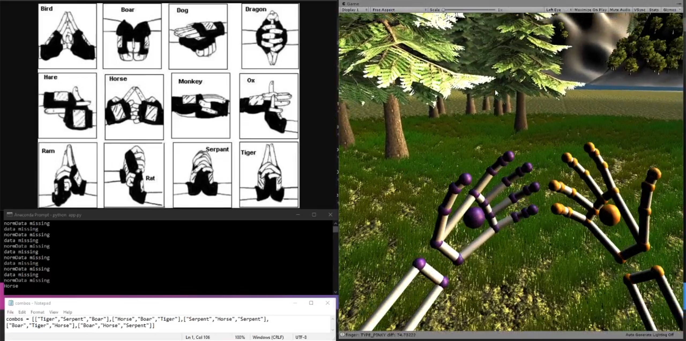
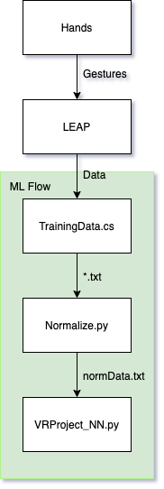
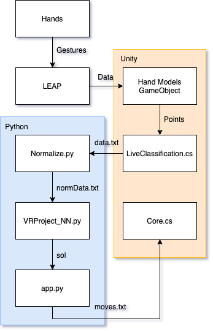

# Table of Contents
- [Introduction](#introduction)
- [Getting Started](#getting-started)
- [Overview](#overview)
- [Videos](#videos)
- [Contributors](#contributors)
- [Acknowledgements](#acknowledgements)

## Introduction

In the Japanese manga series, Naruto, the concept of hand seals (i.e., signs) are used to perform various ninja techniques. These hand gestures aid a character in summoning a spiritual/physical energy to perform said techniques. Different hand gestures in different sequences result in different actions. This is the background topic of this project, and essentially what was intended to be replicated. To expand, the objectives of the project were as per the following:

- Take the movement of fingers and hands as input
- Recognize supported hand signs in an abstract manner (i.e., exact positioning of the hands shouldn’t matter)
- Classify hand sign gestures using neural network in a fast and efficient way
- Use the recognized hand sign to handle the output action in Unity
- Develop an immersive presence for the user through the environment and output responses

## Getting Started

Unity Ver. 2019.2.18f1

Python Ver. 3.7.3

LEAP Motion Orion Ver. 4.0.0

Unity Core Assets Ver. 4.4.0

- Minimum VR Oculus Rift Hardware Requirements: https://support.oculus.com/248749509016567/
- Oculus Rift for corresponding HMD: https://www.oculus.com/setup/ (Rift or Rift S ONLY)
- LEAP Motion Orion Software: https://developer.leapmotion.com/orion#105
- Unity Core Assets: https://developer.leapmotion.com/unity/#5436356

(1) Import project `\vr-env` from repository into Unity.

(2) Make sure that Oculus is runnning in the background and everything is setup for VR use.

(3) Using the Python CLI, route it to the `\app` directory in the project, then run the command:

```
python app.py
```

Note: In the event you have both Python2 and Python3 installed, run the following command:

```
python3 app.py
```

(4) Run the Unity Project

(5) Have fun!

<p align="center">
	</img>
  <p align="center">Screenshot of the setup after getting started.</p>
</p>

## Overview

### Interaction Diagrams

After careful thinking, we came to the agreement that the flow of data in our project would be as per the following when offline:

<p align="center">
	</img>
</p>

And as per the following online:

<p align="center">
	</img>
</p>

For the offline flow, we ended up with a trained machine learning model called `VRProject_NN.py`. This was done after collecting the training data and normalizing it.

For the online flow, Unity passes live classification data to the Python app, from which a gesture is recognized after normalization and written into a file called `moves.txt`. Unity then monitors when that file is updated and handles the output after recognition.

### Script Descriptions

`TrainingData.cs` and `LiveClassification.cs` are responsible for collecting input from LEAP.

`data.txt` is the file written to by `LiveClassification.cs` for normalization purposes.

`Normalize.py` is the class which normalizes the raw data from LEAP after it has been collected.

`normData.txt` contains the normalized LEAP data for our neural network to output a solution.

`VRProject_NN.py` is the file which handles the gesture recognition.

`app.py` writes to a file called `moves.txt` with the gesture being written in an integer format.

`moves.txt` contains the latest gesture that was recognized.

`Core.cs` monitors the changing of moves.txt and handles the according output for the gesture combination in Unity.

## Videos

Assignment video: https://drive.google.com/open?id=16kTtbdZ5tCndPaBLKQxCdG5qERE8Slne

Project in action (full): https://drive.google.com/open?id=1XE88IY18j121Q2-zR780TK9D6FbX-HiL

## Contributors
- Adham E. S. (LEAP)
- Misgav R. (neural network)
- Waqar Y. (Unity front-end)
- Yash K. (Unity back-end)

## Acknowledgements

AllSky - https://assetstore.unity.com/packages/2d/textures-materials/sky/allsky-free-10-sky-skybox-set-146014

Standard Assets for Unity - https://assetstore.unity.com/packages/essentials/asset-packs/standard-assets-for-unity-2017-3-32351

Terrain Tools Sample Asset Pack - https://assetstore.unity.com/packages/2d/textures-materials/terrain-tools-sample-asset-pack-145808

Unity Particle Pack 5.x - https://assetstore.unity.com/packages/essentials/asset-packs/unity-particle-pack-5-x-73777

Rocky Hills Environment (Light Pack) - https://assetstore.unity.com/packages/3d/environments/landscapes/rocky-hills-environment-light-pack-89939
